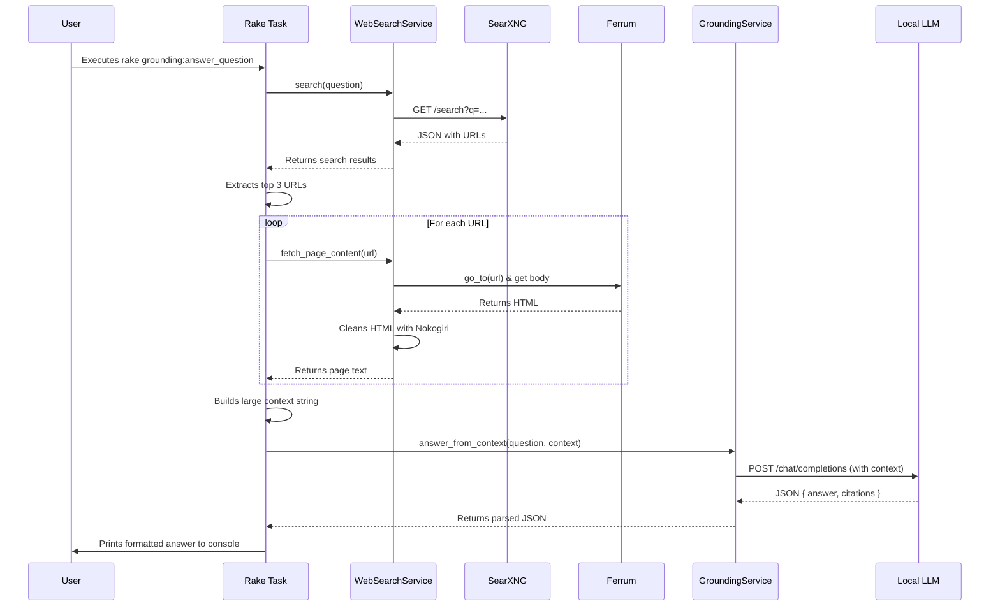

# Current Grounding Flow Architecture

## 1. Overview

This document describes the architecture of the current grounding flow, as implemented in the `grounding:answer_question` rake task. The purpose of this flow is to answer a user's question by performing a live web search, synthesizing the information found, and generating a "grounded" answer based exclusively on the retrieved content.

The entire process is orchestrated within the `grounding:answer_question` rake task and relies on two key services: `WebSearchService` for retrieving web content and `GroundingService` for LLM interaction.

## 2. Key Components

*   **`grounding:answer_question` (Rake Task):** The main entry point and orchestrator. It manages the overall flow from receiving the question to printing the final answer.
*   **`WebSearchService`:** A service responsible for all interaction with the web. It has two primary functions:
    1.  `search`: Queries the `SearXNG` metasearch engine to get a list of relevant URLs for a given question.
    2.  `fetch_page_content`: Uses the `Ferrum` headless browser to load a specific URL, execute JavaScript, and extract the clean text content from the page body.
*   **`GroundingService`:** A service dedicated to interacting with the local Large Language Model (LLM). Its `answer_from_context` method takes the user's question and the context retrieved by `WebSearchService` and prompts the LLM to generate a structured JSON answer.
*   **External Services:**
    *   **SearXNG:** A self-hosted metasearch engine that provides the initial search results.
    *   **Local LLM:** A locally-run large language model (e.g., via `llama.cpp`) that provides the reasoning and generation capabilities.

## 3. Architectural Flow

The process executes in a linear, step-by-step fashion:

1.  **Initiation:** The flow begins when a user runs the `rake grounding:answer_question['Your question here']` command.

2.  **Web Search:** The rake task calls `WebSearchService.search` with the user's question. This service sends an HTTP request to the `SearXNG` instance and receives a JSON response containing a list of search results.

3.  **URL Selection:** The rake task extracts the URLs from the top 3 search results.

4.  **Content Fetching Loop:** The task then iterates through each of the 3 selected URLs:
    *   It calls `WebSearchService.fetch_page_content` for the URL.
    *   `WebSearchService` launches a `Ferrum` headless browser, navigates to the URL, and waits for the page to load.
    *   It then extracts the HTML, uses `Nokogiri` to remove script and style tags, and returns the resulting plain text.

5.  **Context Building:** The rake task receives the text content from each URL, truncates it to 8,000 characters, and concatenates all three pieces of text into a single, large string called `context`.

6.  **LLM Grounding:** The `context` string and the original `question` are passed to `GroundingService.answer_from_context`.
    *   The service constructs a system prompt instructing the LLM to answer the question based *only* on the provided context and to format its response as a specific JSON object containing an `answer` and `citations`.
    *   It then makes an API call to the Local LLM.

7.  **Response Handling:** The rake task receives the structured JSON from the `GroundingService` and prints the final answer and its source citations to the console for the user.

## 4. Sequence Diagram

This diagram illustrates the interactions between the components for a single request.

