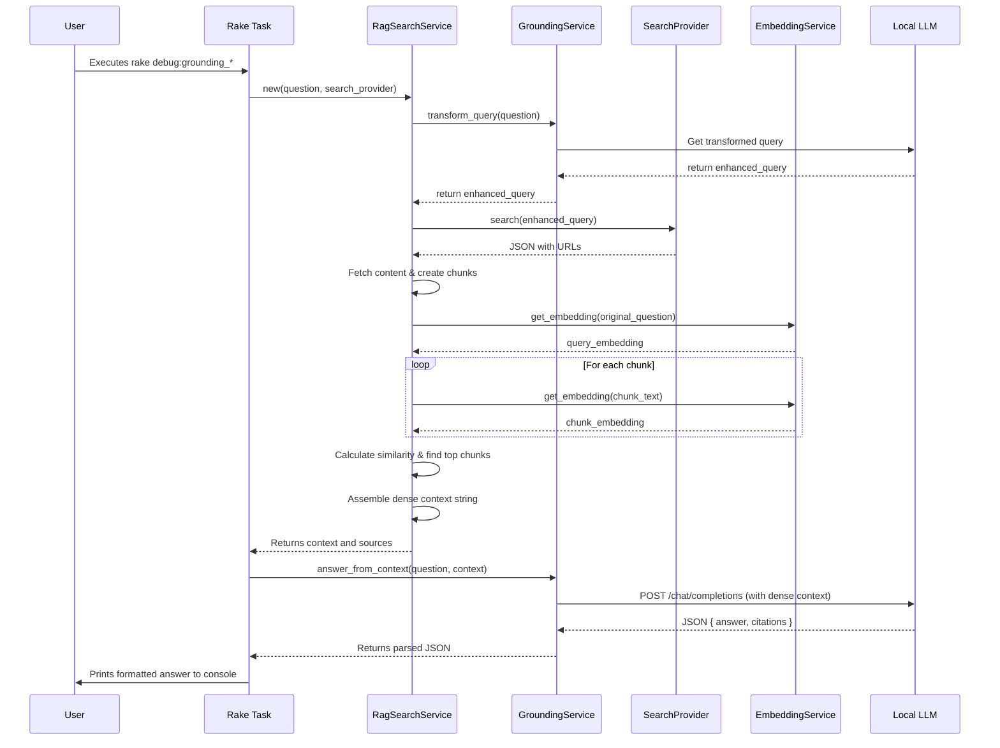

# Architecture and Sequence Diagram: Grounding with Search

This document outlines the architecture and process flow of the web grounding system. The system uses a **Retrieval-Augmented Generation (RAG)** pipeline to answer questions, ensuring the answers are based on real-time web search results. This process is primarily tested and executed via the `debug:grounding_*` Rake tasks.

## 1. System Architecture

The system is designed to answer a user's question by grounding it with information retrieved from a real-time web search. This ensures that the answers are up-to-date and based on publicly available information. The architecture consists of several key components working in concert.

### Core Components

*   **Rake Task (`debug:grounding_*`)**: The initiator of the process. It takes a user's question, calls the `RagSearchService`, and presents the final, grounded answer.

*   **`RagSearchService`**: The central orchestrator of the RAG pipeline. It manages the entire process of searching, fetching, chunking, embedding, and ranking web content to produce a dense, relevant context for the LLM to use.

*   **`GroundingService`**: A service that interacts with the Large Language Model (LLM) for specific analytical tasks:
    1.  **Query Transformation**: Refines the user's raw question into an optimal search engine query.
    2.  **Grounded Answering**: Takes the final, dense context from `RagSearchService` and prompts the LLM to generate an answer with citations based *only* on that context.

*   **Search Provider (`GoogleSearchService` or `WebSearchService`)**: A pluggable service responsible for executing a search against an external search engine (Google Custom Search or SearXNG).

*   **`EmbeddingService`**: A service that communicates with the local embedding server to generate vector embeddings for text, which is critical for semantic ranking.

*   **External Services**:
    *   **Large Language Model (LLM)**: An AI service that performs query transformation and final answer generation.
    *   **Embedding Model Server**: A service that turns text into numerical vector representations.
    *   **Web Search Engine**: An external service (e.g., Google, SearXNG) that returns search results.

## 2. Sequence of Operations (RAG Pipeline)

The process follows a sophisticated RAG pipeline to ensure a high-quality, grounded answer.

1.  **Initiation**: The Rake task receives a question and instantiates `RagSearchService`.
2.  **Query Transformation**: `RagSearchService` calls `GroundingService` to refine the user's question into an effective search query using the LLM.
3.  **Web Search**: `RagSearchService` uses the chosen search provider (e.g., `GoogleSearchService`) to get a list of top URLs.
4.  **Content Fetching & Chunking**: `RagSearchService` fetches the content from the URLs and splits the text into smaller "chunks".
5.  **Embedding & Semantic Ranking**:
    *   `RagSearchService` gets a vector embedding for the original query from the `EmbeddingService`.
    *   It then gets embeddings for *every text chunk*.
    *   It calculates the cosine similarity between the query's embedding and each chunk's embedding to find the chunks that are most semantically relevant.
6.  **Dense Context Synthesis**: The text from the highest-scoring chunks is assembled into a single, dense `context` string. This context is returned to the Rake task.
7.  **Grounded Answer Generation**: The Rake task passes the original question and the dense `context` to `GroundingService`, which prompts the LLM to generate the final answer and citations from the context.
8.  **Display**: The Rake task parses the final JSON response and displays the answer to the user.

## 3. Sequence Diagram

The following diagram visualizes the RAG process flow.

